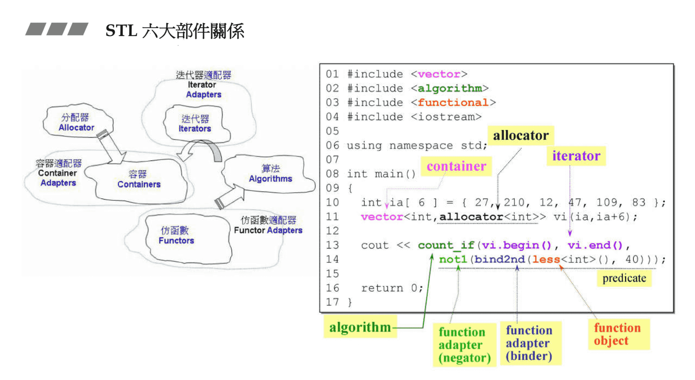

# STL 基础介绍

# C++ SL vs STL

C++ Standard Library
C++ 标准库

Standard Template Library
STL，标准模板库

新式 headers 内的组件封装于 namespace "std"

- using namespace std; or
- using std::cout; (for example)
  旧式 headers 内的组件**不**封装于 namespace "std"

# 书籍

- The C++ STANDARD LIBRARY(2th)（黑色封面有 C++11）
- 《STL 源码剖析》侯捷

# 我们的第一个 C++ STL Application

STL 的设计思想和面向对象是不一样的，并不是把东西都放到类里面去。
STL 六大部件（Components）

- 容器（Containers）
- 分配器（Allocators）
- 算法（Algorithms）
- 迭代器（Iterators）
- 适配器（Adapters）
- 仿函数（Functors）



程序的功能是输出数组中，大于等于 40 的数。
一般来说都会有默认分配器 allocator，可以不用自己写，分配器也是一个模板，需要告诉他分配的类型即可。

注：上面例子中的 `bind2nd()` 在 `C++11` 中弃用，在 `C++17` 中移除，、

# “前闭后开”区间

`c.begin()` 指向第一个元素，`c.end()` 指向最后一个元素的后一个，`*(c.end())`找到的内容是没有意义的
**容器中的元素不一定是占用连续的空间**

```C++
Container<T> c;
...
Container<T>::iterator ite = c.begin();
for(; ite != c.end(); ++ite)
    ...
```

# 循环声明方法(C++11 新特性)

```C++
for (decl : coll){
   statement
}

eg.
for( int i : {2,3,5,7,8}){
    std::cout << i << std:: endl;
}

std:: vector<double> vec;
...
// 这里 elem 是临时变量
for ( auto elem : vec ){
    std:: cout << elem << std::endl;
}

// elem 是每个对象的引用
// 这个循环的作用就是让数组每个数变成原来的 3 倍
for ( auto &elem : vec ){
    elem *= 3;
}
```

auto 虽然减少了代码量，但是还是要明白到底使用的是什么类型
