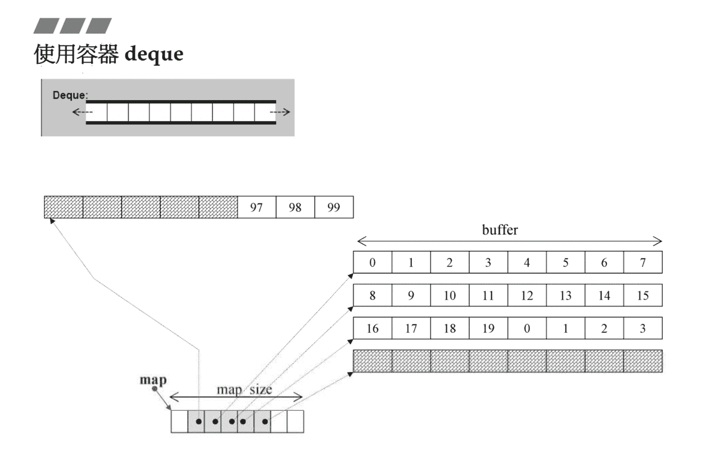
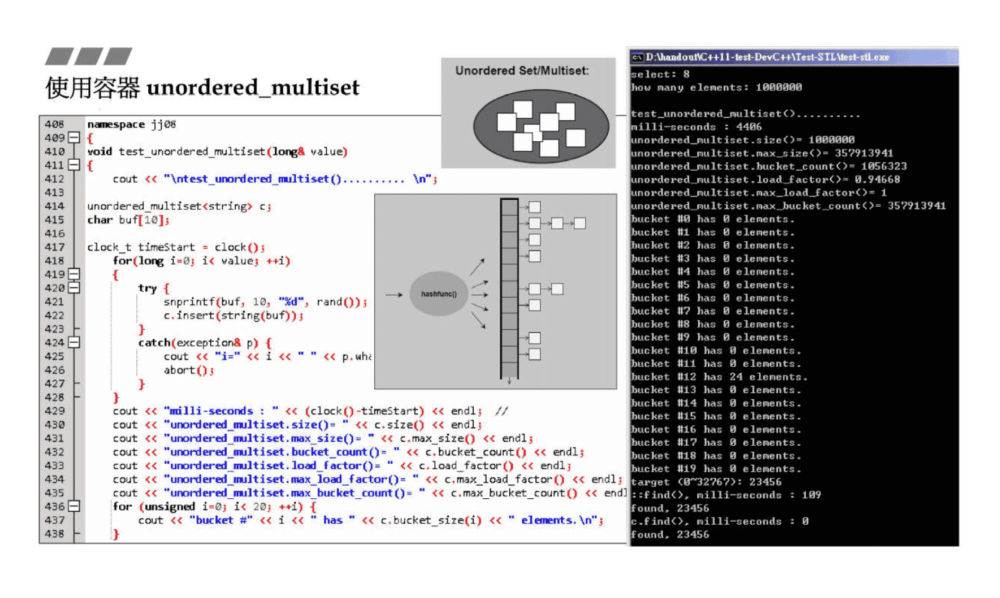

# 容器之分类与各种测试

序列容器

- Array，容量确定的数组
- Vector，可以向后扩容的数组
- Deque，双向队列
- List，双向链表
- Forward-List，单向链表

组合容器（底层使用红黑树）

- Set/Multiset
- Map/Multimap

无序容器（底层使用哈希表）

- Unordered Set/Multiset
- Unordered Map/Multimap

哈希表使用的是 Separate Chaining 结构

# 测试循环与查找

bsearch 是 C 语言自带的库
sort 是标准库中的函数，在进行排序的时候，使用 `sort(c.begin(),c.end())`
如果容器有 sort 方法，使用容器自己的 sort 方法，如对于双向链表 list 使用 `c.sort()`
对于 find 方法也是一样的，一般使用容器自带的方法会更加快

# 双向队列 deque

分段有序的 buffer，但是 deque 让使用者感觉是连续的，大致的底层结构如图



# unordered_multiset

对于很多容器都有 `max_size()` 方法来输出**当前容器**的最大的容量，对于底层使用哈希表实现的容器来说，还有 `bucket_count()` 可以输出篮子的数量，案例代码如下

```C++
namespace jj08 {
    void test_unordered_multiset(long &value) {
        cout << "\ntest_unordered_multiset().......... \n";
        unordered_multiset<string> c;
        char buf[10];
        clock_t timeStart = clock();
        for (long i = 0; i < value; ++i) {
            try {
                snprintf(buf, 10, "%d", rand());
                c.insert(string(buf));
            } catch (exception &p) {
                cout << "i=" << i << " " << p.what() << endl;
                abort();
            }
        }
        cout << "milli-seconds : " << (clock() - timeStart) << endl;
        cout << "unordered_multiset.size()= " << c.size() << endl;
        cout << "unordered_multiset.max_size()= " << c.max_size() << endl;
        cout << "unordered_multiset.bucket_count()= " << c.bucket_count() << endl; //除数篮子的数量
        cout << "unordered_multiset.load_factor()= " << c.load_factor() << endl; // 载重因子
        cout << "unordered_multiset.max_load_factor()= " << c.max_load_factor(); // 最大的载重因子
        cout << "unordered_multiset.max_bucket_count()= " << c.max_bucket_count() << endl;
        // 输出每个篮子里面的对象数量
        for (unsigned i = 0; i < 20; i++) {
            cout << "bucket #" << i << " has " << c.bucket_size(i) << "elements.\n";
        }
    }
}
```



# 分配器 allocator

默认使用的分配器是 `std::allocator<_Tp>`

如 vector 的定义如下
```C++
template<typename _Tp, typename_Alloc = std::allocator<_Tp>>
  class vector : protected_Vector_base<_Tp, _Alloc>
```

下面的测试内容不记录了，对于 allocator 可以去看老师的内存管理那门课
日常在使用的时候一般使用 new 和 malloc，如果直接使用分配器，还需要在释放内存时传入创建的内存大小