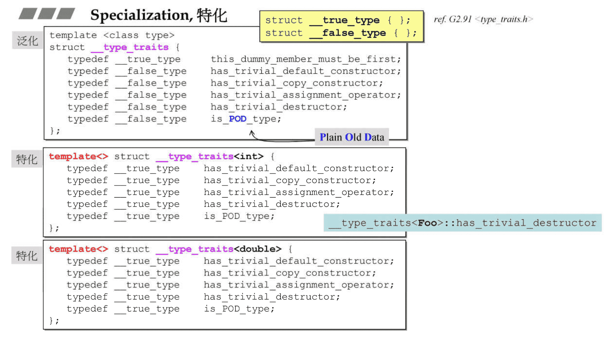
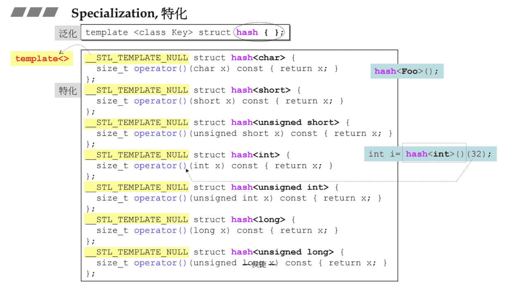
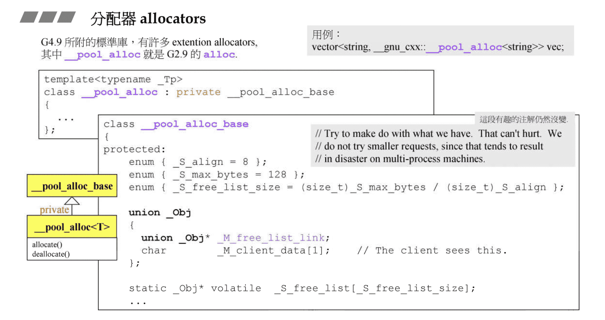

# 源代码之分布（VC,GCC）

课程使用 GNU C++ 2.91.57
还会结合 C++ 4.9.2 的内容讨论

# OOP (面向对象编程) vs. GP (泛型编程）

OOP(Object-Oriented Programming)，GP(Generic Programming)

OOP 企图将 datas 和 methods 关联在一起，GP 想要将 datas 和 methods 分开来

采用 GP：

- Containers 和 Algorithms 团队可以各自闭门造车，通过 Iterator 联通即可
- Algorithms 通过 Iterators 确定操作范围，并通过 Iterators 取用 Container 元素

Iterator 是 Random Access Iterator，就像指针一样，可以直接直接通过位置读取，并且通过操作一次变化位置。
但是对于 list 这样的链表结构，一次只能挪动一个位置

所有 Algorithms，其

```
#include <iostream>

using namespace std;

bool strLonger(const string &s1, const string &s2) {
    return s1.size() < s2.size();
}

// 注意这两个函数不能出现在定义里面，这里写出来为了方便理解，因为这两个 max 函数在标准库已经写好了
// 在 main() 函数中按住 command，点击 max 可以跳转到标准库的定义
template<class T>
inline const T &max(const T &a, const T &b) {
    return a < b ? b : a;
}

template<class T, class Compare>
inline const T &max(const T &a, const T &b, Compare comp) {
    return comp(a, b) ? b : a;
}


int main() {
    cout << "max of zoo and hello: " << max(string("zoo"), string("hello")) << endl; // zoo
    cout << "max of zoo and hello: " << max(string("zoo"), string("hello"), strLonger) << endl; // hello
}
```

# 技术基础:操作符重载 and 模板(泛化, 全特化, 偏特化)

自行熟悉对应操作符重载的使用

重载操作符（非内建的操作符）被称为函数符号

```C++
std::string str = "Hello, ";
str.operator+=("world");    // same as str += "world";
operator<<(operator<<(std::cout<<, str) , '\n'); // same as std::cout << str << '\n';
```

需要注意的是：

- 以下操作符不能被重载 `::`（作用域解析），`.`（成员运算符），`.*`（通过指针的成员运算符），`?:`（三元控制符）
- 这几个操作符不能使用 `**,<>,or &|`
  ...

## Function Templates，函数模板

模板的介绍...

看到弹幕有人问为什么 min 前面要带 &，其实应该把 `T&` 看成一个东西，表示某个类型的引用，传入引用速度更快，避免创建形参。由于这个比较的值是不进行修改的，所以对于 a,b 还有返回值使用 const 声明为常量。
主要注意的是传入的类型 T 如果是自己定义的类型，需要重载运算符 `<` 进行判断，`?:` 三目运算符上一段已经说过不能重载，因为功能已经规定好了。

```C++
#include <bits/stdc++.h>

using namespace std;

// 因为在标准库已经有了对应的定义，所以加了个 namespace
namespace study {
    template<class T>
    inline const T &min(const T &a, const T &b) {
        // 这里的 < 会使用 stone 的重载运算符
        // 如果把 bool operatoer< 那个函数删掉编译就会报错
        return b < a ? b : a;
    }
}
class stone {
public:
    stone() {} //补充一个函数
    stone(int w, int h, int we) : _w(w), _h(h), _weight(we) {}

    bool operator<(const stone &rhs) const {
        return _weight < rhs._weight;
    }

private:
    int _w, _h, _weight;
};

int main() {
    stone r1(2, 3, 1), r2(3, 3, 2), r3;
    r3 = study::min(r1, r2);
}
```

# Specialization，特化

使用模板是为了**泛化**，可以适配不同的类型，但在编程的过程中我们很可能需要对某个类型有一些特别的方法可以让实现让效率更高，于是有了**特化**，简单来说就是**对于特定类型，使用特定的实现方法**，也有点类似重载



下面代码是标准库中散列表使用的特化例子



# Partail Specialization，偏特化

可能模板参数有多个，只对其中部分进行特化，是个数上的偏特化。

还有另一个种范围上的偏特化是对于指针，注意这里第一句 template 中不能写成空，应该是 `template <class T>`

# 分配器 allocators

**平时不推荐自己直接使用分配器**，因为没有需要这么用，而且分配器的效率优劣直接影响到容器的效率优劣。（这里说的效率就是综合时间和空间）

先谈 operator new() 和 malloc()，其实底层最后到会调用到 malloc()，malloc() 申请的空间会比你申请的空间更大，还有一些额外开销，对于这个底层有兴趣，可以去看内存管理的课程

VC6 所附的标准库，其 allocator 实现如下（<xmemory>），VC6 的 allocator 没有任何特殊的设计


```C++
// allocator<int>() 就是创建一个 allocator<int> 临时变量
// 跟 vector<int>() 类似，平时我们都是这么使用
// vector<int> a = vector<int>();
int *p = allocator<int>().allocate(512, (int *) 0);
// 这里就是之前提到了释放的时候还需要加上 512 这个内存的大小
// 我们平时只会记住指针，自己记录空间大小比较麻烦
allocator<int>().deallocate(p, 512);
```

由于直接使用的 malloc，如果你创建的容量为 100W 的容器，里面每个元素都是一个 int，但是 malloc 创建每个元素的时候都会有额外的开销，那么这个开销会是巨大的

下面演示的 BC5 的处理方式也是差不多的，不过多使用了一个 define

```
# define _RWSTD_COMPLEX_DEFAULT(a) =a
// BC5 在源代码中这么写
template <class T, class Allocator _RWSTD_COMPLEX_DEFAULT(allocator<T>) >
// 其实在 define 替换之后跟 VC 一样，还是
template <class T, class Allocator = allocator<T> >
```

但是在 BC5 中 allocate 的实现中给了第二个参数一个默认参数，在调用的时候可以这么写

```C++
int *p = allocator<int>().allocate(512);
allocator<int>().deallocate(p, 512);
```

VC，BC 和 GNUC 的 `allocator` 实现方式都是一样，效率不太理想。但 GNUC 2.9 使用的是自己另外实现的分配器 `alloc`，减少额外开销主要就是减少 malloc 的次数。

到了 GNUC 4.9，又将默认的 allocator 改成了原来的效率不高的实现方式，但是高效的方式以 extention allocators 的方式保留下来了，注意要使用 `_gnu_cxx` 的命名空间


