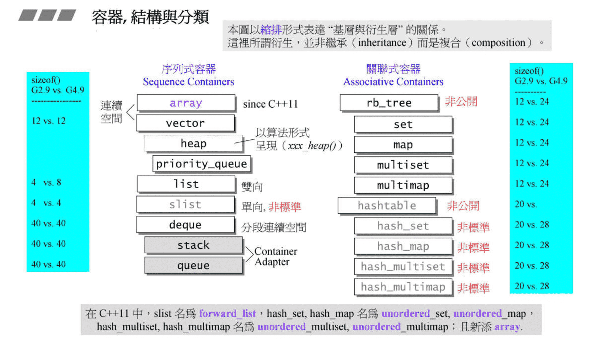
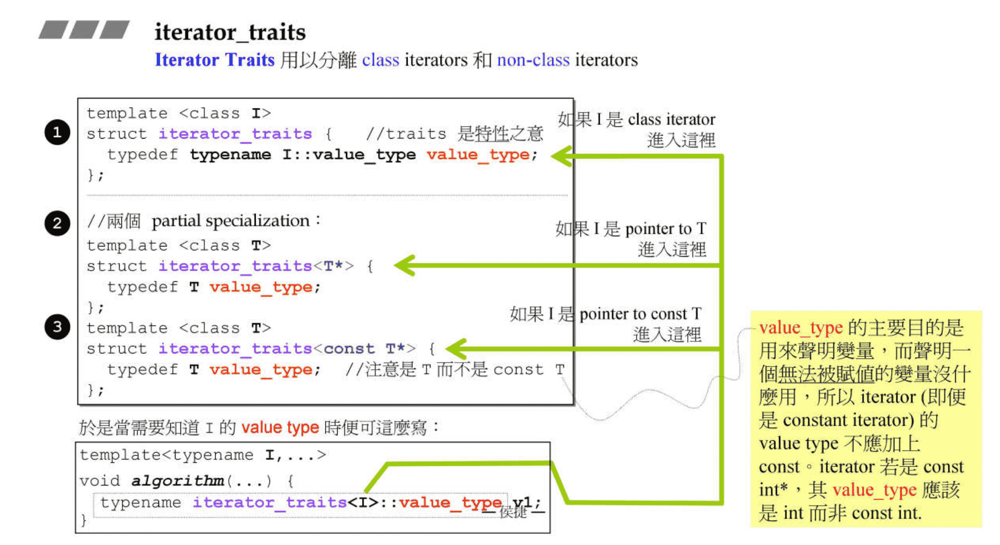

# 容器之间的实现关系与分类

在容器之间使用的并不是继承（inheritance）的关系，而是组合（讲义上叫复合，composition）



# 容器 list

老师讲的很清楚，不过多记录，仔细听课，把各种基础串起来了

i++ 和 ++i 之间的速度快慢从这里可以很容易理解，因为 ++i （老师叫前缀，prefix form）返回的是引用对象，没有临时对象产生，所以效率更高

```C++
// postfix form 后缀运算符重载，i++
self operator++(int) { self tmp = *this; ++*this; return tmp;}
// prefix form 前缀运算符重载，++i
self& operator++() { node = (link_type)((*node).next); return *this; }
```

同时对上面这两种 ++，老师还举了一个有趣的例子，

```C++
// 对于 list 的操作符重载一个返回 self，一个返回 self& 也是为了模拟 int 的对应规则
list<int> c;
...
auto ite = c.begin();
++++ite; -> ++(++ite);
ite++++; -> (ite++)++; // ×，错误使用

// i++ 返回的是一个临时的值，叫做右值
// 编译报错，error: lvalue required as increment operand
// 即需要一个左值来进行自增操作
eg.
int i(6);
++++i; -> ++(++i);
i++++; -> (i++)++; // ×，错误使用
```

上面讲到了 list 为了这样模拟，我们当然也可以写一个能够使用 `++++` 的类，这个例子是便于理解，并不是推荐大家这么使用，因为 ++ 的通用习惯已经约定俗成

```C++
#include <bits/stdc++.h>

using namespace std;

class t {
public:
    t() : a(0) {}

    int a;

    t &operator++(int) {
        a++;
        return *this;
    }
};

int main() {
    t test;
    // 中间不打空格也行，clion 自动格式化加了空格
    test++ ++;
    cout << test.a << endl;
}
```

# Iterator 需要遵循的原则

这里讲了个老师叫 萃取机 trait，`value_type` 就是放在容器的元素的类型，`difference_type` 的意思是同一个容器里面两个 Iterator 的距离，一般默认是 `long int`（我在 gcc 4.9.4 中看到的），如果里面的放的 Iterators 的数量超过了 `long int` 那么设计就失效了，程序会 crash 崩溃

五种 type 是 Iterator 相关的类型（就是迭代器设计出来要能满足算法的提问）

```C++
template<class T, class Ref, class Ptr>
struct __list_iterator {
    typedef bidirectional_iterator_tag iterator_category;
    // ptrdiff_t 标准库中提供的，如果超过则会崩溃
    typedef ptrdiff_t different_type;
    typedef T value_type;
    // 这两种从未在 C++ 标准库中被使用过：引用和指针
    typedef Ref reference;
    typedef Ptr pointer;
    ...
};
```

如果 iterator 并不是一个 class 呢？那就不具有对应对应的 5 个相关类型，例如 native pointer（它被视为一种退化的 iterator）

# Traits 特性，特征，特质



Iterator Traits 用来分辨 class iterators 和 non-class iterators。在算法使用的时候可能没有对应的 5 中 type，所以使用中间层 Traits 来转化，下面是完整的 iterator_traits

```C++
// 泛化的 traits
template<class I>
struct iterator_traits {
    typedef typename I::iterator_category iterator_category;
    typedef typename I::value_type value_type;
    typedef typename I::difference_type difference_type;
    typedef typename I::pointer pointer;
    typedef typename I::reference reference;
};
// partial specialization for regular pointers
// 对于 普通指针 的偏特化
template<class T>
struct iterator_traits<T *> {
    typedef random_access_iterator_tag iterator_category;
    typedef T value_type;
    typedef ptrdiff_t difference_type;
    typedef T *pointer;
    typedef T &reference;
};
// partial specialization for regular const pointers
// 对于 普通 const 指针 的偏特化
template<class T>
struct iterator_traits<const T *> {
    typedef random_access_iterator_tag iterator_category;
    // 注意是 T 而不是 const T
    // value_type 的主要目的是用来声明变量，而声明一个 无法被赋值 的变量没有什么用
    // 所以 iterator（即便是 constant iterator）的 value_type 不应加上 const
    // iterator 若是 const int*，其 value_type 应该是 int 而非 const int
    typedef T value_type;
    typedef ptrdiff_t difference_type;
    typedef T *pointer;
    typedef T &reference;
};
```
