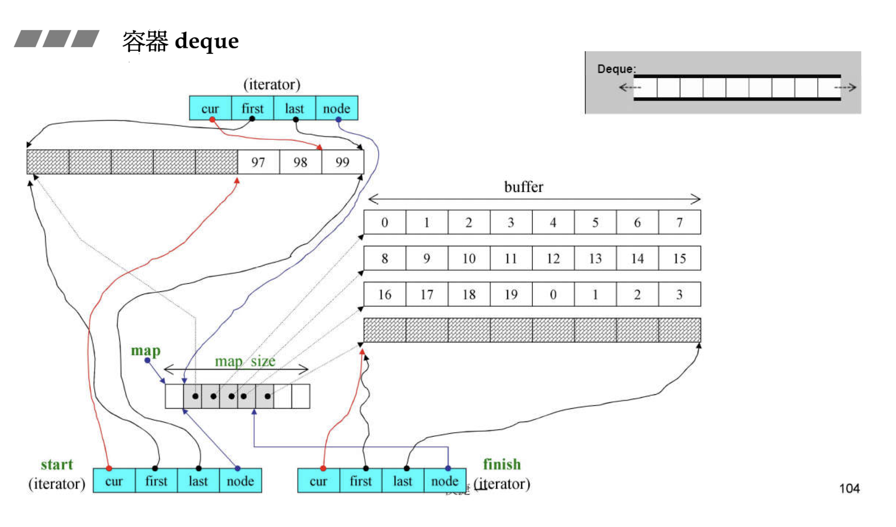

# 容器 vector

vector 在使用的过程中，如果容量满了需要扩充，要开辟一块内存空间，然后将现在有的所有内容复制到新的空间，**不能在原地扩充**

vector 的扩充不一定都是 2 倍，看实现，vc 中有 1.4 倍的实现，一般是 1-2 倍

这里需要注意的是 `insert_aux` 函数，因为 `insert_aux` 不只会被 `push_back` 调用，还可能会被 `insert` 函数调用，所以在函数逻辑中

- 首先需要检测是否还有剩余空间
- 在开辟新的空间复制完了 position 之前的内容之后还需要复制 position 后面到 finish 的内容

# 容器 array

为什么要讲数组包装成容器？主要还是为了提供之前提到的 5 种不同的类型，以便给 STL 的算法去使用

array 和其他容器不一样的是一定要指定大小

```C++
template <typename _Tp, std::size_t _Nm>
struct array{
    ...
}
// 使用的时候
array<int, 10> myArray;
auto ite = myArray.begin();
  // array<int, 10>::iterator ite = ...
ite+=3;
cout<<*ite;
```

# 容器 deque

deque 是分段连续的，迭代器中有四个元素

- cur，指向当前 buffer 中的某个点
- first，指向当前 buffer 的起点
- last，指向当前 buffer 的终点
- node，指向当前 buffer 在 map 中对应的节点



deque 的 iterator 的 iterator_category 是 random_access_iterator_tag，可以随机存取的指针，就是可以跳跃使用，给使用者连续的“假象”，实现方式显而易见，对 iterator 的操作进行重载

