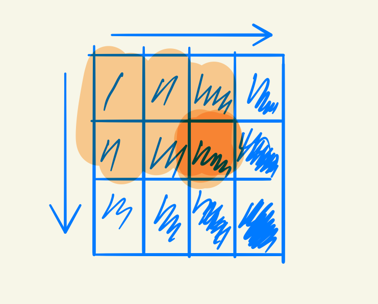

# 1-二维数组中的查找

- [链接](https://www.nowcoder.com/practice/abc3fe2ce8e146608e868a70efebf62e)
- [讨论](https://www.nowcoder.com/questionTerminal/abc3fe2ce8e146608e868a70efebf62e)

## 题目描述

在一个二维数组中（每个一维数组的长度相同），每一行都按照从左到右递增的顺序排序，每一列都按照从上到下递增的顺序排序。请完成一个函数，输入这样的一个二维数组和一个整数，判断数组中是否含有该整数。

## 题目分析

这个数组有一个特点，就是每个位置的位置都是在自己向上和向左围成的矩形中最大的元素。

  
 
解法：这一题可以从左下角和右上角开始找。以从左下角为例，遇小往上移动，遇大往右移动即可。

Code

<<<@/books/code/jz/1.cpp

